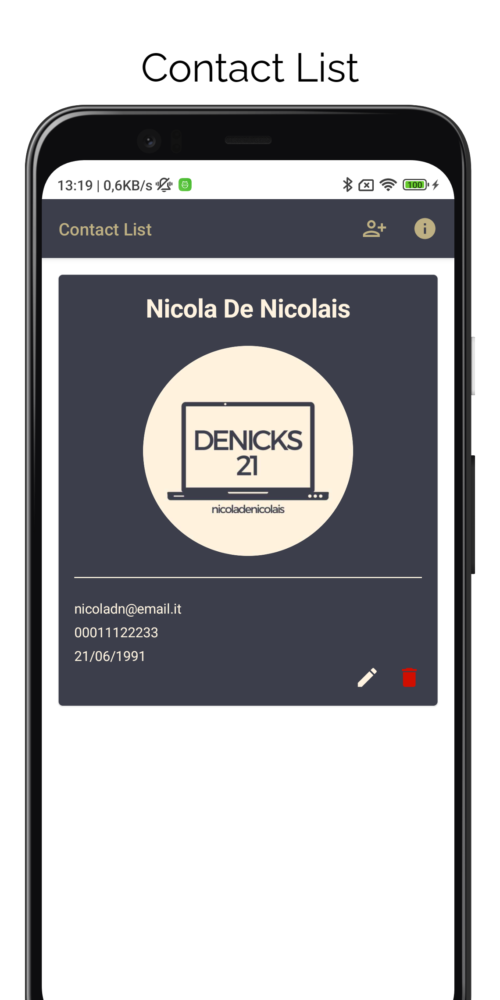

# Contact List
> <b>Author: Nicola De Nicolais</b>

## 📄 Description
Android application built with Kotlin and Jetpack Compose that shows how to perform CRUD operations in the Room database using Android Architecture Components and the MVVM Architecture Pattern.<br/>

## 🔨  How to install and run the project
Clone this repository :<br/>
`
git clone https://github.com/ndenicolais/ContactList.git
`

Import the project into Android Studio :

1. File -> New -> Import Project
2. Browse to <path_to_project>
3. Click "OK"

Create a new virtual device or connect an Android device to your computer.</br>
Click Run to start the project on the selected device.

## 🛠️ Built with
Kotlin</br>
Jetpack Compose</br>
Room</br>
Date Picker</br>
Coil

## 📚 Package Structure

```
com.denicks21.contactlist       # ROOT PACKAGE
│
├── activities                  # ACTIVITIES FOLDER
|   ├── EditContactActivity     # Activity to add or edit a user.
|   ├── IntroActivity           # Splashscreen of the app.
|
├── composables                 # COMPOSABLES FOLDER
|   ├── ActionItem              # Topbar item.
|   ├── CustomAlertDialog       # Custom alert dialog.
|   ├── CustomTextField         # Custom TextField.
|   ├── DatePicker              # Component that allow to select a date.
|   ├── ImagePicker             # Component that allow to select an image.
|
├── repositories                # REPOSITORIES FOLDER
│   ├── ContactsRepository      # Repository operations.
|
├── roomdb                      # ROOM DB FOLDER
│   ├── Contacts                # Contact model.
│   ├── ContactsDao             # Contact DAO.
│   ├── ContactsDatabase        # Contact Database.
|
├── ui                          # UI FOLDER
│   ├── theme                   # THEME FOLDER
|   │   ├── Color               # Color palette used by the app.
|   │   ├── Shape               # Components shapes of Compose used by the app.
|   │   ├── Theme               # Theme used by the app.
|   │   ├── Type                # Typography styles for the fonts used by the app.
|
├── utils                       # UTILS FOLDER
│   ├── Converters              # Class that convert date and time.
│   ├── Validation              # Class that verify user information.
|
├── viewmodels                  # VIEWMODELS FOLDER
│   ├── ContactViewModel        # Model that interact with repository class.
|
├── MainActivity                # Main activity
```

## 📎 Screenshots
<p float="left">

